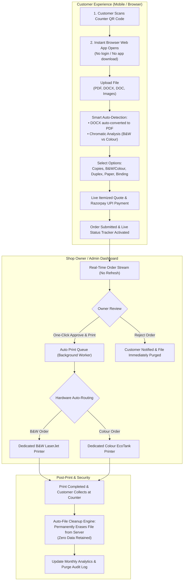

# Click2Print™ — Complete Architecture & Implementation Plan

> **Product Definition:** Automated counter & campus print cloud platform.  
> **Core Promise:** *"From QR scan to printed document — fully automated in under 60 seconds."*  
> **Privacy Guarantee:** 100% zero-retention privacy — customer files are permanently erased the moment printing finishes.

---

## 1. Executive Summary & Product Overview

Traditional campus xerox shops and commercial print counters suffer from major bottlenecks:
- Long physical queues with students crowding the counter.
- Manual file transfer via WhatsApp, email, or USB drives (spreading viruses and wasting minutes per customer).
- Manual page counting, color inspection, and price negotiation.
- Operators manually opening Word files, converting them, selecting printers, and adjusting print margins.

**Click2Print™** replaces this entire friction with a streamlined, 4-step web cloud automation architecture:
1. **Customer Scans Shop QR Code:** Direct browser upload without app downloads or login registration.
2. **Uploads Document & Configures:** Supports PDF, Word (DOCX/DOC), and Images with auto-conversion and smart colour/mono page analysis.
3. **Shop Owner Approves on Dashboard:** Real-time incoming stream with 1-click approve & print or 1-click reject & file purge.
4. **Auto-Print & Auto-Delete:** Hardware auto-routes jobs to dedicated B&W or Colour printers; files are wiped immediately upon print completion.

---

## 2. System Architecture & End-to-End Workflow



---

## 3. Core Architectural Modules

### Module 1: Customer Scan & Print Portal (`CustomerOrder.ts`)
- **Zero-Friction Access:** Operates as a progressive web app accessed directly via the shop counter QR code URL.
- **Multi-Format Document Intake:**
  - PDF documents (vector & raster).
  - Microsoft Word documents (`.docx`, `.doc`) with automatic background conversion to standard PDF format to prevent font substitution or pagination shifts.
  - Images (`.png`, `.jpg`, `.jpeg`) with automatic photo page scaling.
- **Smart Chromatic Detection (`colorAnalyzer.ts`):**
  - Scans document pages to classify them as monochrome text vs color graphics.
  - Allows customers to choose **Smart Auto-Detect** (paying color rates only for color pages) or force B&W/Full Color.
- **Configurable Print Parameters:**
  - Number of copies.
  - Page range (All pages or custom ranges like `1-5, 8, 11-15`).
  - Sides: Single-sided or Double-sided (Duplex) with real-time sheet savings tally.
  - Paper format & grade: Standard A4 (75 GSM), Premium A4 (100 GSM), A3 Poster.
  - Optional finishing: Corner staple (+₹5), Spiral coil binding with clear cover (+₹30).
- **Payment Gateway Integration:**
  - Built-in Razorpay online payment simulation (UPI QR, PhonePe, Google Pay, Paytm, Cards).
  - Alternative "Pay at Counter" option for cash transactions.
- **Live Real-Time Order Tracker:**
  - Visual 4-step stepper (`Submitted` ➔ `Approved` ➔ `Printing` ➔ `Ready`).
  - Hardware routing destination badge (e.g. `Auto-Routed to: Dedicated B&W LaserJet`).
  - Animated print progress bar.
  - Zero-retention privacy assurance badge.

---

### Module 2: Print Order Management (`OwnerDashboard.ts` — Tab 1)
Directly maps to **Image 2** of the product architecture:
1. **Live Order Dashboard:** Real-time incoming queue updated via reactive state subscription without page reloads.
2. **Full Order Details:** Order number, customer name, phone, file name, total pages, page range, copies, color mode, sides, paper grade, binding, notes, and payment status.
3. **One-Click Approve & Print:** Moves pending orders into the Auto Print Queue and activates the background printer worker silently.
4. **Reject Order:** Declines invalid orders with a single tap, alerts the customer, and immediately purges the file from the server.
5. **Auto Print Queue:** Background print queue worker simulates hardware spooling, track progress percentages, and plays audio feedback.
6. **B&W / Colour Auto-Routing:** Inspects order parameters and automatically routes B&W orders to the monochrome printer and colour orders to the color printer.
7. **DOCX Support:** Visual badges identifying Word documents that were auto-converted to PDF.
8. **Status Filters:** *All Orders*, *Pending Approval*, *Auto Print Queue*, *Ready for Pickup*, *Completed*, and *Rejected*.

---

### Module 3: Printer Management (`OwnerDashboard.ts` — Tab 2)
Directly maps to **Image 1** of the product architecture:
1. **Dedicated B&W Printer Setup:**
   - Dropdown configuration for black-and-white hardware (HP LaserJet Pro M404dn, Brother HL-L2321D, Canon LBP2900B, Epson M200).
   - Monitors status (Online/Offline), toner level, paper tray count, and network IP.
   - Auto-routing toggle: *"All B&W orders route to it automatically from then on."*
2. **Dedicated Colour Printer Setup:**
   - Dropdown configuration for color hardware (Canon PIXMA G3010, Epson EcoTank L3250, HP Smart Tank 580, Epson L8050).
   - Monitors 4-color ink tank levels (CMYK), paper tray status, and network IP.
   - Auto-routing toggle: *"Colour orders are routed to it without any manual switching."*
3. **Test Print Button:**
   - Single-tap diagnostic test pattern generator.
   - Launches calibration modal verifying CMYK ink density, 256-level gradient ramps, font sharpness (12pt, 9pt, 6pt microtext), and hardware latency.
4. **Print Your Shop QR:**
   - Renders a full A4-size counter poster with shop name, counter location, high-resolution QR code, and 4-step customer instructions.
   - Integrated browser print styling (`@media print`) for instant counter mounting.

---

### Module 4: Usage & Settings (`OwnerDashboard.ts` — Tab 3)
Directly maps to **Image 4** of the product architecture:
1. **Monthly Usage Tracking:**
   - Tracks total pages printed in the current month.
   - Visual stacked bar breakdown of B&W vs Colour page distribution.
   - Financial ledger of total revenue earned.
   - Paper sheets saved metric resulting from duplex printing.
2. **Easy Printer Settings:**
   - Simple dropdown-based printer selection.
   - Toggles for *Auto-Print upon Approval* and *Enforce 100% Privacy Auto-Cleanup*.
   - Shop name, counter address, and contact number configuration.
3. **Auto File Cleanup:**
   - Automated server-side deletion engine.
   - Live audit trail displaying recent purged files with timestamps and trigger reasons (`PRINT_COMPLETED` or `ORDER_REJECTED`).
4. **Razorpay Online Payments:**
   - Configuration panel for Razorpay Key ID and Merchant UPI VPA.
   - Status indicators for UPI apps (GPay, PhonePe, Paytm, BHIM).
5. **Custom Per-Page Pricing:**
   - Live editable rate inputs:
     - B&W Single-Sided (₹/pg) — Default: ₹2.00
     - B&W Duplex Rate (₹/sheet) — Default: ₹3.00
     - Colour Single-Sided (₹/pg) — Default: ₹10.00
     - 100 GSM Premium Paper Upgrade (+₹/pg) — Default: ₹1.00
     - Spiral Binding Rate (+₹) — Default: ₹30.00
     - Corner Staple Rate (+₹) — Default: ₹5.00
   - Instant save action: applies directly to all subsequent customer orders.

---

### Module 5: How Click2Print Works (`OwnerDashboard.ts` — Tab 4)
Directly maps to **Image 3** of the product architecture:
- 4-step horizontal pipeline with numbered step badges:
  1. *Customer Scans QR Code*
  2. *Uploads Document & Selects Options*
  3. *Shop Owner Approves on Dashboard*
  4. *Auto-Print & Auto-Delete*
- Includes an interactive **"⚡ Run 30-Second End-to-End Simulation"** button for customer and operator training.

---

## 4. Directory Structure & Code Organization

```
smartprint-app/
├── CLICK2PRINT_ARCHITECTURE_AND_IMPLEMENTATION_PLAN.md   # This document
├── index.html                                            # Root semantic HTML markup
├── package.json                                          # Dependencies and build scripts
├── server.js                                             # Lightweight Node.js HTTP server
├── tsconfig.json                                         # TypeScript compilation configuration
├── styles/
│   └── main.css                                          # Design system & responsive styles
├── src/
│   ├── main.ts                                           # Application bootstrap & lifecycle
│   ├── components/
│   │   ├── Header.ts                                     # Navigation & brand switcher
│   │   ├── CustomerOrder.ts                              # Customer scan & print portal
│   │   ├── OwnerDashboard.ts                             # Shop owner management console
│   │   └── Modals.ts                                     # QR poster, test print & payment modals
│   ├── core/
│   │   ├── audio.ts                                      # Web Audio API synthesizers
│   │   ├── events.ts                                     # Event bus & activity history
│   │   └── store.ts                                      # Central reactive state store
│   ├── services/
│   │   ├── colorAnalyzer.ts                              # Chromatic page analysis engine
│   │   └── pricingEngine.ts                              # Dynamic pricing calculation
│   └── types/
│       ├── index.ts                                      # Type re-exports
│       └── order.ts                                      # Domain types & interfaces
└── dist/                                                 # Compiled ES2022 JavaScript output
```

---

## 5. Security & Zero-Data Retention Policy

| Aspect | Implementation |
| :--- | :--- |
| **Document Retention** | Files are stored in temporary transient memory/scratch storage during spooling and are **permanently wiped** the instant print execution finishes. |
| **Order Rejection** | If an operator declines an order, the customer file is **purged immediately** with an entry logged in the audit trail. |
| **Payment Security** | Card and UPI credentials are never handled or logged by the print counter server; all transactions run via Razorpay checkout. |
| **Hardware Isolation** | Separate network channels for monochrome and color spoolers prevent document cross-contamination. |

---

## 6. Deployment & Running Locally

### Development Mode
```bash
# 1. Install dependencies
npm install

# 2. Build TypeScript bundle
npm run build

# 3. Start local server
npm start
```
Server runs at `http://localhost:3000`.

### Production Deployment Options
1. **Node.js Process (PM2 / Systemd):**
   ```bash
   npm run build
   npx pm2 start server.js --name "click2print"
   ```
2. **Docker Container:**
   ```dockerfile
   FROM node:20-alpine
   WORKDIR /app
   COPY package*.json ./
   RUN npm install
   COPY . .
   RUN npm run build
   EXPOSE 3000
   CMD ["node", "server.js"]
   ```
3. **Static Cloud Storage + Serverless Functions:**
   - The compiled frontend (`index.html`, `dist/`, `styles/`) can be hosted on AWS S3, Cloudflare Pages, or Firebase Hosting.
   - Print spooling commands can be proxied to local shop printers via a local print daemon (IPP/CUPS or Windows Spooler API).

---

## 7. Future Roadmap Enhancements

- **Direct Cloud-to-Printer Driver (IPP/CUPS):** Integration with network printer raw sockets (`port 9100`) for zero-driver direct physical printing.
- **WhatsApp Bot Integration:** Send automated WhatsApp notifications to customers when their order status moves to `READY`.
- **Multi-Counter Fleet Management:** Support multiple counter operators managing 5+ printers simultaneously with load balancing.
